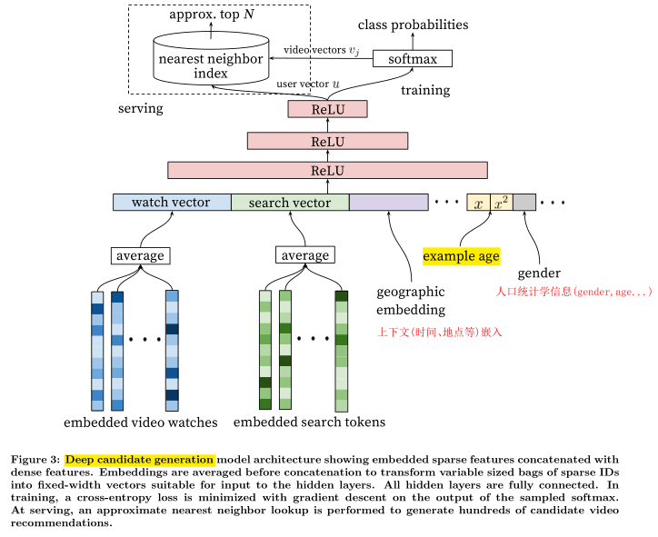
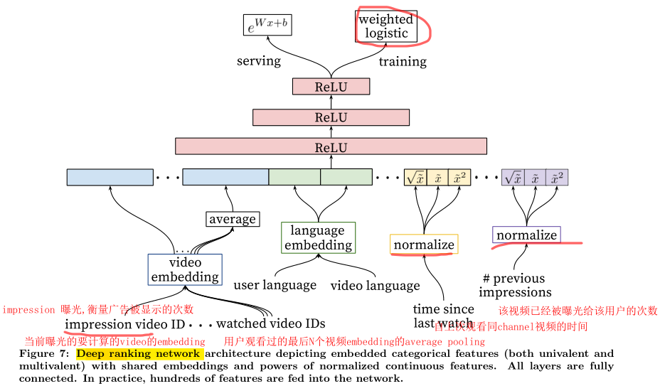

## 1.Introduction
2016,Youtube的深度推荐系统论文《Deep Neural Networks for YouTube Recommendations》,有很多宝贵的工程细节
整体上将预测next watch问题当做一个分类问题

## 2.The Model Architecture
Youtube作为全球最大的UGC的视频网站，视频库非常之大，整个推荐过程分为两步走：
- Candidate Generation Model: 初筛，候选视频集合由millions降至hundreds，其主体是多层fc+ReLU，training时采用softmax，serving时采用nearest neighbor search.
- Ranking Model: 精排，候选视频降至dozens（推荐列表），其主体是多层fc+ReLU，training时采用了weighted logistic regression，serving时采用exp(Wx+b)的形式预测expected watch time
- 另外，需要注意两个模型输入部分的特征工程

## 3.Engineering Details

3.1 candidate generation model
需要注意几个问题：
- 自底而上看这个网络，最底层的输入部分引入了大量的特征:除了历史观看记录embedded video watches，历史搜索记录embedded search tokens，还包括geographic
embedding，example age，gender等，将所有的这些特征concat起来，送入上层的fc+ReLU网络
- 视频库非常之大，如何解决softmax的计算问题？
- training时使用的是我们熟悉的softmax分类，为什么online serving的时候不这样做而要使用nearest neighbor search 的方法？详见Q&A部分

3.2 ranking model
  整理架构与candidate generation model比较相似，主要差别在于特征工程,引入另一套DNN作为ranking model的目的就是引入更多描述视频、用户以及二者之间关系的特征，达到对候选视频集合准确排序之目的：
"During ranking, we have access to many more features describing the video and the user’s relationship to the video because only a few hundred videos are being scored rather than the millions scored in candidate generation. Ranking is also crucial for ensembling different candidate sources whose scores are not directly comparable."

## 4.Q & A
- 使用softmax训练时如何解决超大视频库带来的

## 5.Code

