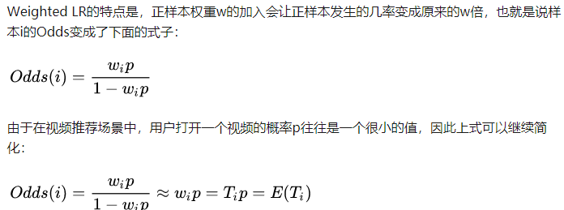

## 1.Introduction
2016,Youtube的深度推荐系统论文《Deep Neural Networks for YouTube Recommendations》,有很多宝贵的工程细节
整体上将预测next watch问题当做一个分类问题

## 2.The Model Architecture
Youtube作为全球最大的UGC的视频网站，视频库非常之大，整个推荐过程分为两步走：
- Candidate Generation Model: 初筛，候选视频集合由millions降至hundreds，其主体是多层fc+ReLU，training时采用softmax，serving时采用nearest neighbor search.
- Ranking Model: 精排，候选视频降至dozens（推荐列表），其主体是多层fc+ReLU，training时采用了weighted logistic regression，serving时采用exp(Wx+b)的形式预测expected watch time
- 另外，需要注意两个模型输入部分的特征工程

## 3.Engineering Details

3.1 candidate generation model
    
需要注意几个问题：
- 自底而上看这个网络，最底层的输入部分引入了大量的特征:除了历史观看记录embedded video watches，历史搜索记录embedded search tokens，还包括geographic
embedding，example age，gender等，将所有的这些特征concat起来，送入上层的fc+ReLU网络
- 视频库非常之大，如何解决softmax的计算问题？
- training时使用的是我们熟悉的softmax分类，为什么online serving的时候不这样做而要使用nearest neighbor search 的方法？详见Q&A部分

3.2 ranking model

整体架构与candidate generation model比较相似，主要差别在于特征工程,引入另一套DNN作为ranking model的目的就是引入更多描述视频、用户以及二者之间关系的特征，达到对候选视频集合准确排序之目的：
- "During ranking, we have access to many more features describing the video and the user’s relationship to the video because only a few hundred videos are being scored rather than the millions scored in candidate generation. Ranking is also crucial for ensembling different candidate sources whose scores are not directly comparable."

## 4.Q & A
1、文中把推荐问题转换成多分类问题，在预测next watch的场景下，每一个备选video都会是一个分类，因此总共的分类有数百万之巨，这在使用softmax训练时无疑是低效的，这个问题YouTube是如何解决的？
- 答：负采样，可参考word2vec中的负采样,但暂不确定是否一样

2、在candidate generation model的serving过程中，YouTube为什么不直接采用训练时的model进行预测，而是采用了一种最近邻搜索的方法？另外user vector和video vector是怎么生成的？
- 答：（1）在model serving过程中对几百万个候选集逐一跑一遍模型的时间开销显然太大了，因此在通过candidate generation model得到user 和 video的embedding之后，通过最近邻搜索的方法的效率高很多。我们甚至不用把任何model inference的过程搬上服务器，只需要把user embedding和video embedding存到redis或者内存中就好了
- （2）**user vector u是最后一个隐层的输出，video vector v是从softmax层的权重**(这里softmax层其实是fc+ softmax激活函数，所以就是最后一个fc层的权重)。这里说的softmax层其实是fc+ softmax激活函数，假设最后一个hidden layer维度是100代表user embedding，输出节点维度200w表示videos，全连接权重维度就是[100，200w]，而hidden layer与每一个输出节点的权重维度就是[100，1]，这就是一个vedio对应embedding，计算一个vedio的概率时是u*v，即两个100维向量做内积，经过softmax激活之后，就变成概率分布。

3、Youtube的用户对新视频有偏好，那么在模型构建的过程中如何引入这个feature？

- Example Age就是用训练时间的最后一刻减去Sample Log产生的时间用来有效区分点击的时间影响，预测时置为0保证预测时处于训练的最后一刻，论文也说了还可以稍微负一些，虽然还没试过，但可以理解为处于训练窗口以后的时间去预测。example age这个feature能够很好的把视频的freshness的程度对popularity的影响引入模型中，见论文图4

4、在对训练集的预处理过程中，YouTube没有采用原始的用户日志，而是对每个用户提取等数量的训练样本，这是为什么？

- 答：减少高度活跃用户对于loss的过度影响

5、YouTube为什么不采取类似RNN的Sequence model，而是完全摒弃了用户观看历史的时序特征，把用户最近的浏览历史等同看待，这不会损失有效信息吗？
- 答：开放性问题。这个原因应该是YouTube工程师的“经验之谈”，如果过多考虑时序的影响，用户的推荐结果将过多受最近观看或搜索的一个视频的影响。YouTube给出一个例子，如果用户刚搜索过“tayer swift”，你就把用户主页的推荐结果大部分变成tayer swift有关的视频，这其实是非常差的体验。为了综合考虑之前多次搜索和观看的信息，YouTube丢掉了时序信息，讲用户近期的历史纪录等同看待。
但RNN到底适不适合next watch这一场景，其实还有待商榷，@严林 大神在上篇文章的评论中已经提到，youtube已经上线了以RNN为基础的推荐模型， 参考论文如下： https://static.googleusercontent.com/media/research.google.com/en//pubs/archive/46488.pdf
看来时隔两年，YouTube对于时序信息以及RNN模型有了更多的掌握和利用

6、在处理测试集的时候，YouTube为什么不采用经典的随机留一法（random holdout），而是一定要把用户最近的一次观看行为作为测试集？

- 答：只留最后一次观看行为做测试集主要是为了避免泄露future information，产生与事实不符的数据穿越

7、在确定优化目标的时候，YouTube为什么不采用经典的CTR，或者播放率（Play Rate），而是采用了每次曝光预期播放时间（expected watch time per impression）作为优化目标？
- 答：这个问题从模型角度出发，是因为 watch time更能反应用户的真实兴趣，从商业模型角度出发，因为watch time越长，YouTube获得的广告收益越多。而且增加用户的watch time也更符合一个视频网站的长期利益和用户粘性。

8、在进行video embedding的时候，为什么要直接把大量长尾的video直接用0向量代替？
- 答：这又是一次工程和算法的trade-off，把大量长尾的video截断掉，主要还是为了节省online serving中宝贵的内存资源。当然从模型角度讲，低频video的embedding的准确性不佳是另一个“截断掉也不那么可惜”的理由。

9、除了用0向量embedding替代长尾内容，有没有其他好的方法？
-（1）低频特征可能去掉比embedding更好效果更好，和您说的一样，出现次数太少emb学不好。实际可以用HashBucket去映射，对于大规模稀疏ID类特征，实际使用上用Hash不会对结果产生太大影响，反而在增量更新的情况上可能会比置为0更好
-（2）可以将长尾都设为UNK，再对UNK训练一组embedding。不过跟同设成0是否有区别还不好说

9、针对某些特征，比如#previous impressions，为什么要进行开方和平方处理后，当作三个特征输入模型？
- 答：这是很简单有效的工程经验，引入了特征的非线性。从YouTube这篇文章的效果反馈来看，提升了其模型的离线准确度

10、为什么ranking model不采用经典的logistic regression当作输出层，而是采用了weighted logistic regression？
- 答：因为在第7问中，我们已经知道模型采用了expected watch time per impression作为优化目标，所以如果简单使用LR就无法引入正样本的watch time信息。因此采用weighted LR，将watch time作为正样本的weight，在线上serving中使用exp(Wx+b)做预测可以直接得到expected watch time的近似，完美

11、接10问，为什么serving部分的exp(Wx+b)可以表示expected watch time？
- 答：serving部分计算exp(Wx+b)，对应一个事件的odds（=p/(1-p), 可由LR推导出来）, 而Weighted LR使用用户观看时长作为权重，使得对应的Odds表示的就是用户观看时长的期望。简要推导如下：

## 5.Code（TODO）
github上可以找到一些tensorflow的实现，但基本没有可以运行的，官方好像没有开源。
- 可参考[QingqingSUN/YoutubeNet](https://github.com/QingqingSUN/YoutubeNet)

## 6.Ref
- [重读Youtube深度学习推荐系统论文](https://zhuanlan.zhihu.com/p/52169807)
- [YouTube深度学习推荐系统的十大工程问题](https://zhuanlan.zhihu.com/p/52504407)
- Covington, P., J. Adams and E. Sargin (2016). Deep neural networks for youtube recommendations
- [揭开YouTube深度推荐系统模型Serving之谜](https://zhuanlan.zhihu.com/p/61827629)
- [Deep Neural Network for YouTube Recommendation论文精读](https://zhuanlan.zhihu.com/p/25343518)
